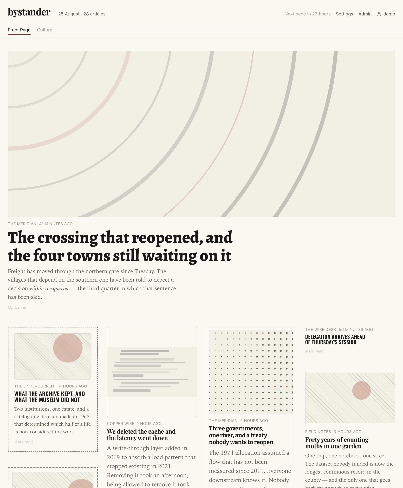
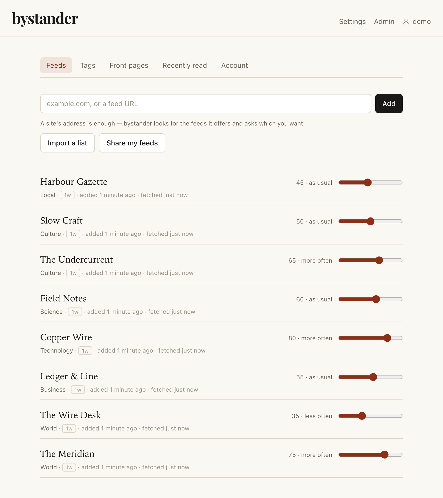
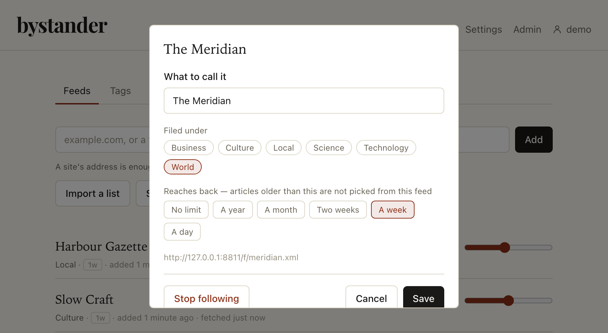
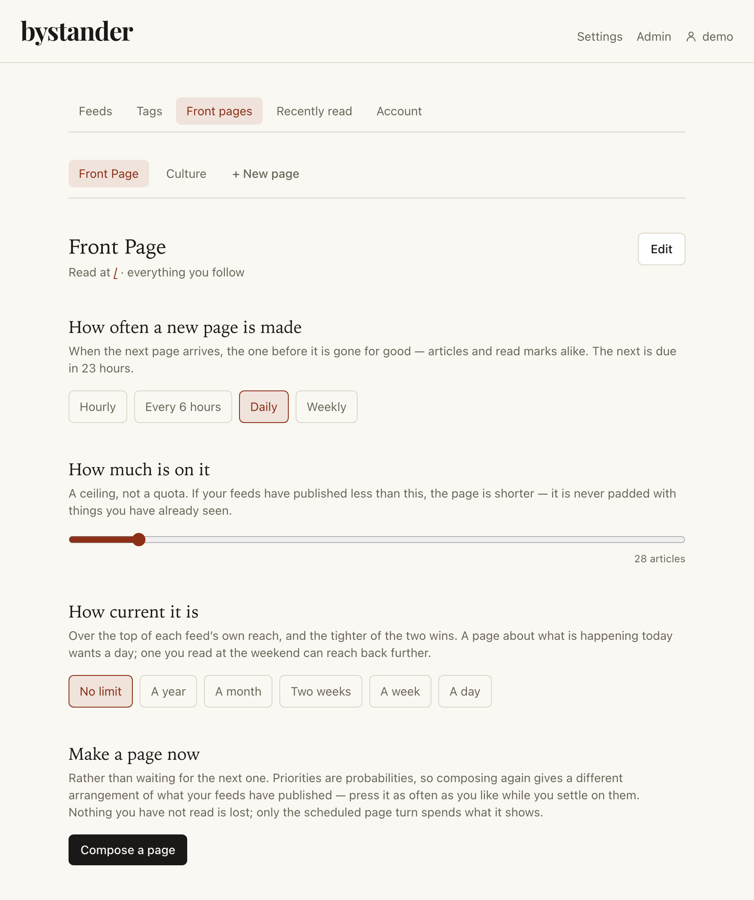
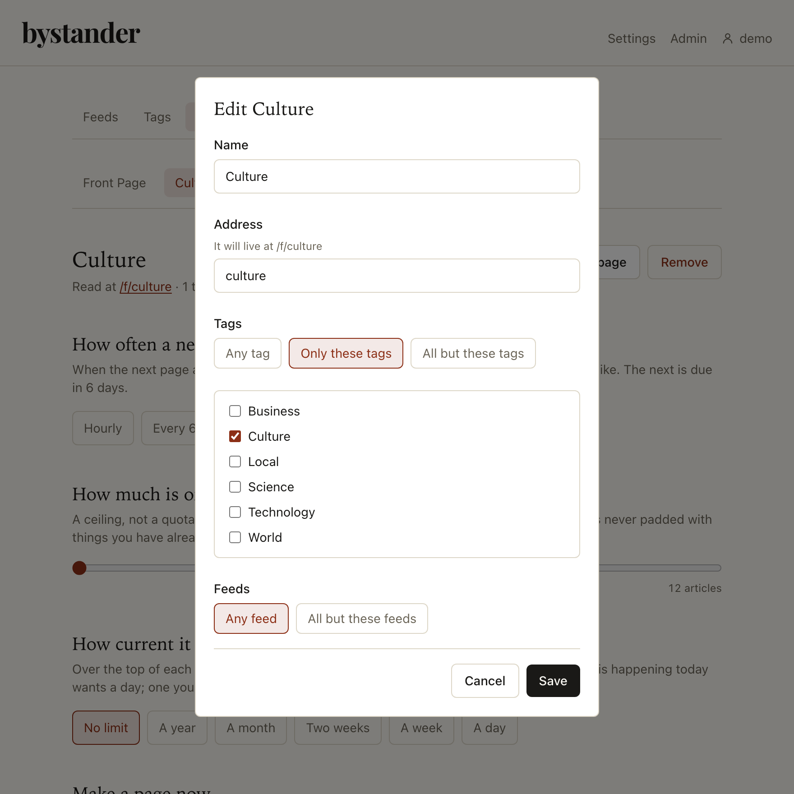
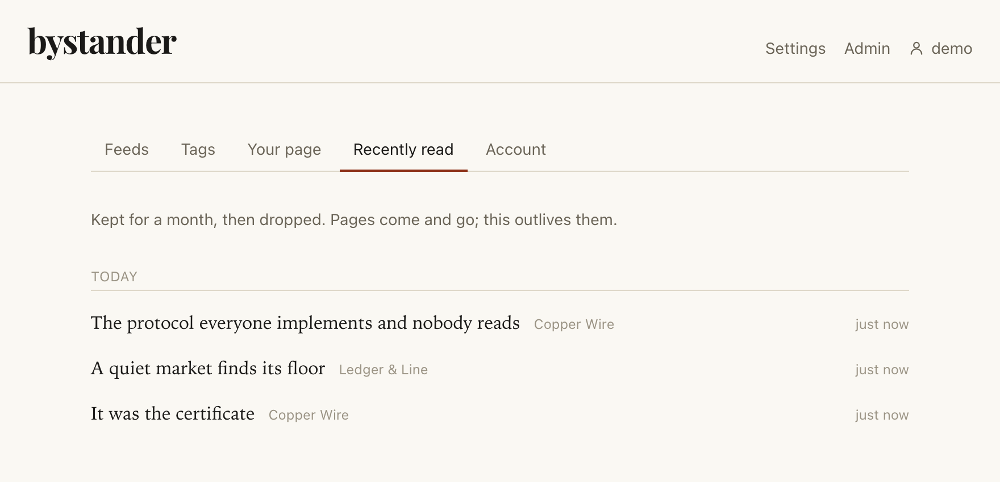
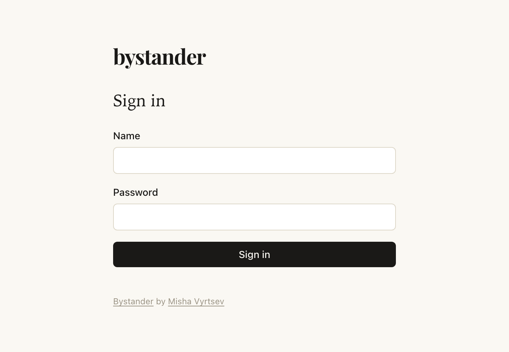

# bystander

An RSS reader with no unread count.

It fetches your feeds on a schedule and composes a **front page** from them — a fixed set
of articles, in fixed positions, laid out like a newspaper. When the next page is made, the
previous one is gone for good.

You can keep more than one. A daily page of everything, a finance page that turns hourly, a
long read for the weekend — each drawing from the feeds you choose, on a schedule of its own.

Nothing accumulates. Nothing is owed. A feed that publishes forty items a day contributes
the same handful as one that publishes two.

## What it looks like

[](docs/screenshots/frontpage.png)

A lead, two features and the rest, in positions fixed when the page was made. The headlines
are not all in one face; that is [Typography](#typography), below.

| | |
| --- | --- |
| [](docs/screenshots/feeds.png) | [](docs/screenshots/feed.png) |
| The feeds you follow, and what each is worth to you | Everything about one feed, behind its name |
| [](docs/screenshots/pages.png) | [](docs/screenshots/page.png) |
| Each front page: how often it turns, how much is on it, how current it has to be | And what it is allowed to draw from |
| [](docs/screenshots/read.png) | [](docs/screenshots/login.png) |
| What you have already read — the only list here | The way in, which is an invitation and never a default password |

Real captures of the real reader; only the publications are invented. They are regenerated
by [`docs/screenshots/capture.sh`](docs/screenshots/), which builds the thing, runs it
against eight stand-in publishers and drives headless Chromium at the result.

## Why

Every reader I have used turns reading into bookkeeping. A number goes up, and the only way
to make it go down is to look at everything — so the feeds you love get skimmed alongside
the feeds you kept out of habit, and eventually you stop opening the app because it has
become a chore with a scoreboard.

bystander has no scoreboard. It cannot tell you what you missed, because it does not keep
what you missed. You get a page. You read what interests you. Tomorrow you get a different
page.

## Run it

```
docker run -d --name bystander \
  -e BYSTANDER_PUBLIC_URL=https://read.example.com \
  -v bystander-data:/data \
  -p 8080:80 \
  ghcr.io/reeywhaar/bystander:latest
```

On an empty database it prints an invitation link to become its administrator:

```
docker logs bystander
```

Open that link, choose a name and a password, and you are in. There is no default password
at any point, so there is nothing for anybody to forget to change. If the link scrolls out
of the log:

```
docker exec bystander bystander invite
```

Then add a feed. A site's address is enough — bystander follows it to the feed it names, and
offers you the list when it names several.

### Bringing a list in, and getting one out

**Import a list** under Settings → Feeds takes an OPML file or a pasted list of addresses.
It reads the list first and shows you the plan — which feeds, filed under which of your
tags, and which are already yours — and imports only what you tick. An import is somebody
else's decisions arriving in bulk, and applying that unseen is how you end up with a
taxonomy you did not choose and cannot unpick.

**Share my feeds** goes the other way: pick some or all of them and get either a plain list
of addresses or an OPML file. That OPML is flat, with tags in each outline's `category`
attribute rather than as folders, because a feed here can carry several tags and a folder is
a tree. The reader is more forgiving than the writer and takes folders too, since that is
what everything else exports.

## How a page is made

Each feed carries a **priority** from 0 to 100, and so does each **tag** you file it under.
Both default to 50.

Priority is a **probability of being drawn, not a sort order**. A feed at 90 appears more
often than one at 10 across pages, without ever silencing it — which over a week reads as
variety rather than a fixed running order. Zero means never: a real setting, and how you
keep a feed subscribed but out of rotation.

Composing a page draws repeatedly: a tag weighted by its priority, then a feed within it
weighted by its, then that feed's newest article you have not been shown. It repeats until
the page is full or the pool runs dry.

Two things bound it:

- **Volume buys nothing.** A draw picks a feed and then takes one article from it, so a
  publisher posting forty times a day is drawn no more often than one posting twice, at the
  same priority. A feed's share of the page is its share of the priorities — which is what
  the slider says, and the only thing it says.
- **A page is filled out rather than left half empty.** When your feeds have published
  little, the rest of the page comes from what you have already been shown — the ones that
  went past unread first, and anything you actually read comes back greyed rather than
  pretending to be new. When there is nothing left at all, the page really is short.

Each article is given a **slot** — lead, feature, standard or brief — when the page is
made, and stored. The browser renders slots; it does not choose them. That is why the page
you leave is the page you come back to, down to the position of every card.

Marking an article read greys it **in place**. It does not move, collapse or disappear:
where an article sits is how you remember where you were, and rearranging under you would
be the unread-count problem wearing a different hat.

A read mark belongs to the composition it was made on, and goes when that page turns. Reading
is still about you rather than about the tab you were looking at, so marking an article read
marks it on every front page it is currently on — and the record below outlives all of them.

### More than one front page

The page at `/` is your **Front Page**. It cannot be removed or renamed, and until you make a
second one there is nothing else to see.

A second page is a **name, an address and a filter** — it lives at `/f/its-address`, and the
reader grows a strip of tabs to move between them. Each carries its own answers to the three
questions the Front Page already answered: how often it is composed, how much is on it, and how
far back it reaches. A finance page turning hourly with fifteen articles and a day's reach is a
different object from a Sunday page of long reads turning weekly.

The filter is two controls that compose. **Tags**: any, only these, or all but these. **Feeds**:
the same, and the second control offers only the direction the first did not — a page already
held to a set of tags does not also need "only these feeds", because the tags already chose
them; what is useful is dropping one. Everything is saved in one gesture, because a mode changed
without its list is a page drawing from the wrong things — briefly, and then for a week.

**Pages are views, not shares.** An article that belongs on two of them appears on both. What
each page remembers separately is what *it* has shown, so a weekly page is not quietly emptied
by a daily one that got there first. What you have **read** is the opposite: that is a fact
about you and an article, so reading it on one page reads it on every page it is on.

Editing a filter composes the page again straight away — it changes what the page is made of,
and a page that says it draws from one thing while showing another is a page that looks broken
until its next turn. Changing how often it turns does not: that describes the next composition,
not the one you are reading.

### Typography

A newspaper has never set every headline on a page in one face. It keeps a handful of
display faces and picks between them story by story, and that is most of what makes a sheet
of forty unrelated headlines read as one publication rather than as a list of links — which
is exactly the problem a page composed out of strangers' feeds has.

So there are six **voices**, one per genre of display face rather than six variations on
one: a didone, an antique, a plain transitional workhorse, a slab, a condensed gothic and a
humanist. Each carries its own scale and leading, because the faces do not agree about how
big twenty pixels is.

Which article gets which is **random, and decided once**. The face is a function of the
article's id, so the same article is in the same face on every load and in every tab for as
long as it is on the page — the same reason its position is fixed. No two headlines in a row
share a face, which is the one rule a newspaper's headline typography actually has.

The face is not the only thing drawn per article. A card may be **boxed** — one in five,
in a line, weight, ink and inset each drawn separately, so no two boxes on a page are quite
the same object. A long body may be set in **two, three or four columns**, as many as its
width can carry. A picture is cut to its own shape where anything has measured it, and to a
drawn one where nothing has. A boxed card may set its picture **beside** the story rather
than above it. And a **rule** runs across the page every fifty cards or so, which is what
breaks a long page into bands.

All of it comes off one seeded stream per card, keyed on the edition and the article
together — so the page is identical on reload and different tomorrow. The point is not
decoration: a page of fifty identical cards has one landmark on it, and "it was somewhere in
the middle" is all anybody can recall. A card with an outstanding shape is a card that can be
looked *for*.

The faces are served from this instance and never from Google, so rendering a page makes no
request to a third party. Latin, Latin Extended and Cyrillic; about 400 KB in the binary,
of which a browser fetches only the subsets a page has glyphs in. A script they cannot draw
falls back to the reading face, which is what the page did before any of this existed.
[`web/scripts/fetch-fonts.sh`](web/scripts/fetch-fonts.sh) holds the list, and adding one is
a line in it.

What you **read** is kept for as long as you follow the feed, and the most recent five hundred
are under Settings → Recently read. Unfollow a feed and what you read there goes with it.

It is kept because it has a job beyond the list: an article you have read is never offered to
any of your pages again, and a record that expired would hand a story back a year later as
though it were new. That is the opposite of an unread count — it counts nothing, it holds only
what you have already dealt with, and nothing about it asks anything of you. It is a list you
never have to visit, backing a promise you never have to think about.

### How far back a feed reaches

Each feed carries its own window — a day, a week, a fortnight, a month, a year, or no
limit — set under **Settings → Feeds**, in the row you open. Articles older than it are not
picked from that feed. A week by default.

Per feed and not per person, because a news site worth a day and a blog that posts monthly
are exactly the pair one number cannot serve. Articles are kept for as long as the longest
window anybody set needs, so choosing a year means a year is there to reach into.

### How often a feed is fetched

Not on a timer you set. Each feed is fetched as often as it publishes — the median gap between
its recent articles — held between **half an hour and a week**.

The point is the slow end. A comic published every three weeks polled every half hour is three
hundred and thirty-six requests between articles; measured against nineteen real feeds, following
the publishing rate cuts fetches by about four fifths, and nearly all of that saving is there. A
news wire still gets looked at every half hour.

One bound is worth naming because it is easy to get wrong. A feed carries a fixed number of
items and the oldest falls off as new ones arrive, so waiting longer than that window loses
articles **permanently** — there is nowhere else to get them. The interval is therefore also
held under half the span between the oldest and newest article the feed is carrying, measured
rather than assumed. A feed that publishes ten items in an hour and then nothing for a month has
a median of weeks and a window of one hour, and this is what catches it.

A feed with fewer than three articles says nothing about its own rate, and is fetched daily
until it does.

### Making a page yourself

**Make a different page** in the reader's footer — and **Front pages** under Settings — composes
one now rather than waiting for the schedule. It is a *re-roll*, not a page turn: articles
you have not read go back in the pool first, so you can press it as often as you like while
settling on your priorities and watch what actually changes. Only the scheduled turn spends
what it shows.

This is most of what you want on a fresh instance, where the first page would otherwise be
a day away.

## Configuration

| variable | default | meaning |
| --- | --- | --- |
| `BYSTANDER_PUBLIC_URL` | *required* | The address you open in a browser, e.g. `https://read.example.com` |
| `BYSTANDER_DATA_DIR` | `/data` | Where the two databases live |
| `BYSTANDER_LOG_LEVEL` | `info` | `debug`, `info`, `warn`, `error` |

`BYSTANDER_PUBLIC_URL` **has to be told and cannot be inferred.** `Host` and
`X-Forwarded-Host` are both client-supplied, and an invitation link built from a header a
stranger controls is an invitation link a stranger controls. Startup fails without it
rather than guessing. It also decides whether the session cookie carries `Secure`, so an
`http://` value in production is a real mistake and is logged as a warning at startup.

The listen port is `:80` inside the container and is not configurable. Remap it with `-p`.

There is no config file. Three variables do not need one.

## Command line

```
bystander serve          run the reader (the image's default)
bystander invite         mint an invitation link; --user for an ordinary account
bystander healthcheck    what the image's HEALTHCHECK runs
bystander version
```

`bystander invite` is the way back in when the first link is gone, and the only way in that
does not require an account already.

## Two databases

```
/data/main.db      accounts, sessions, invitations, feeds, tags, subscriptions   back this up
/data/derived.db   fetched articles, the live pages, what each has shown         delete it freely
```

That asymmetry is the point of the split. Losing `derived.db` costs one fetch cycle;
losing `main.db` loses the product. It is also what lets read marks live where they do —
on the page rather than on the article — so nothing has to be migrated or reconciled when
a page is discarded.

Back `main.db` up with `sqlite3 main.db ".backup out.db"` or a filesystem snapshot, not
`cp`: a plain copy of a WAL database while it is being written is a copy of an inconsistent
moment.

Articles are kept for as long as the longest window anybody set needs — a month at least,
a year at most, since unbounded growth is not a setting anybody meant to choose. The record
of what a page has *shown* is kept three times longer than that, so it always outlives the
article it refers to and a long-dormant feed cannot resurface something that page has already
carried.

## What it deliberately does not do

- **No unread count.** Not on a tag, not on a feed, not in the title. This is the product.
- **No archive and no search.** A front page, not a library. Anything worth keeping is
  worth keeping somewhere that is not here.
- **No push, email digest or mobile app.** The page is the product.
- **No folders.** Tags nest and a feed can carry several of them, which a folder cannot.
- **No web font fetched from anywhere else.** The headline faces are served from this
  instance, so rendering a page makes no request to a third party.
- **No CORS.** The browser only ever talks to this origin, and that absence is what makes
  two of the three CSRF defences worth anything. There is a test asserting the header is
  never emitted.

## Security

- Passwords are bcrypt at cost 12. A wrong name and a wrong password are refused
  identically, and take the same time, so the login form is not a list of who has an
  account here.
- Session cookies are `HttpOnly`, `SameSite=Lax`, and `Secure` when the public URL is
  https. Sliding expiry of one week since last use.
- The session table is keyed by `sha256` of the cookie value and stores only that hash.
  Invitation tokens likewise. A database file, a backup or a heap dump therefore contains
  nothing replayable — and a lost invitation link is reissued rather than recovered.
- Changing a password, or disabling an account, ends its sessions in the same transaction.
- Feed HTML is sanitized at ingest against a small allowlist — every script dropped, every
  attribute but a resolved `href` removed — so the safe form is what is stored and nothing
  downstream has to sanitize again.

## Development

```
go test ./...                    # works with no frontend build present
cd web && npm ci && npm test
cd web && npm run build          # then rebuild the binary to embed it

docs/screenshots/capture.sh      # regenerate the screenshots above
web/scripts/fetch-fonts.sh       # re-download the headline faces
```

Both scripts write files that are committed, so neither is part of a build. They exist so
that "where did these come from" has an answer that can be re-run.

`web/dist/.gitkeep` is tracked and `vite.config.ts` deliberately does not empty the
directory: `//go:embed all:dist` needs something to match, or a fresh clone fails to
compile before Node has ever run.

Design notes live in `private/docs/` — the entity model, the selection algorithm, the API
conventions, and the reasoning behind each.
